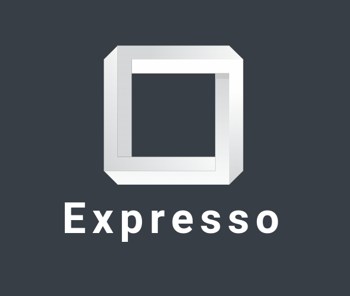
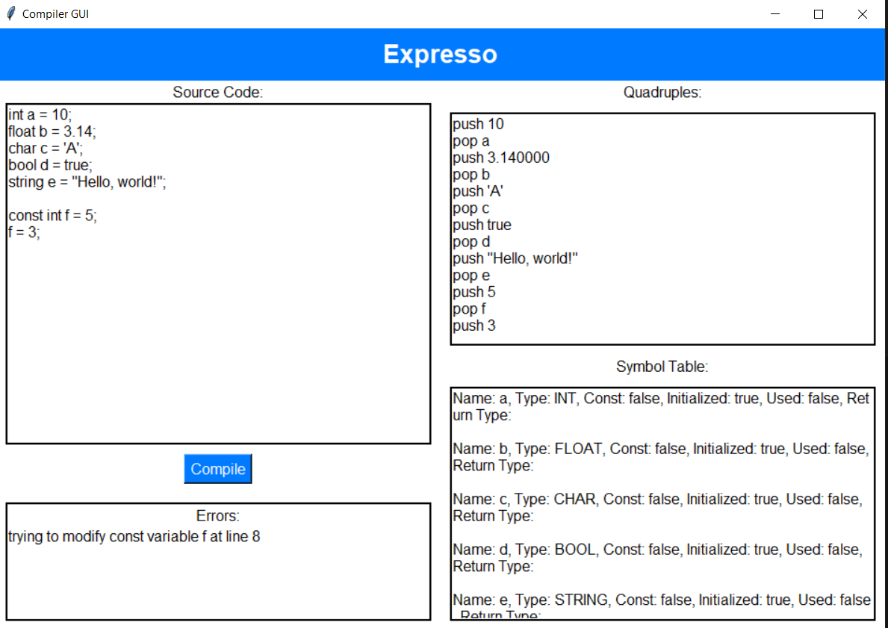
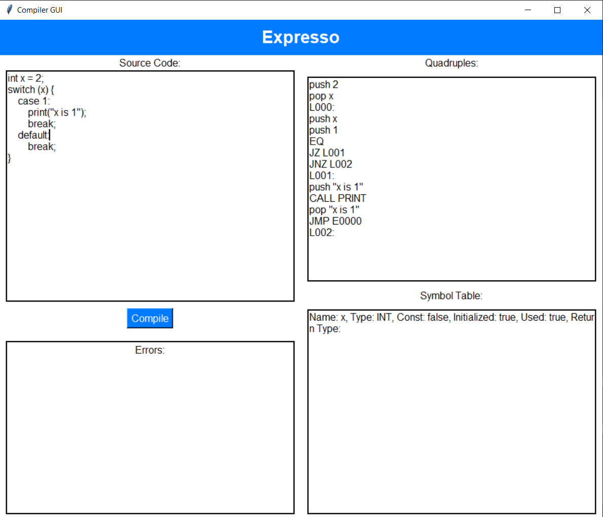
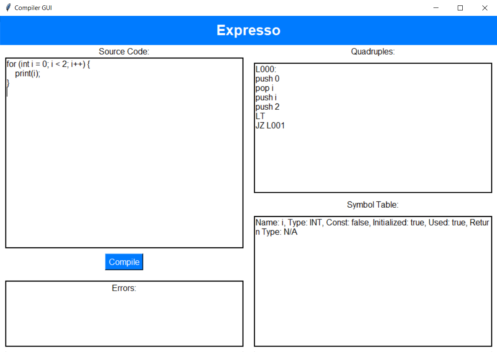
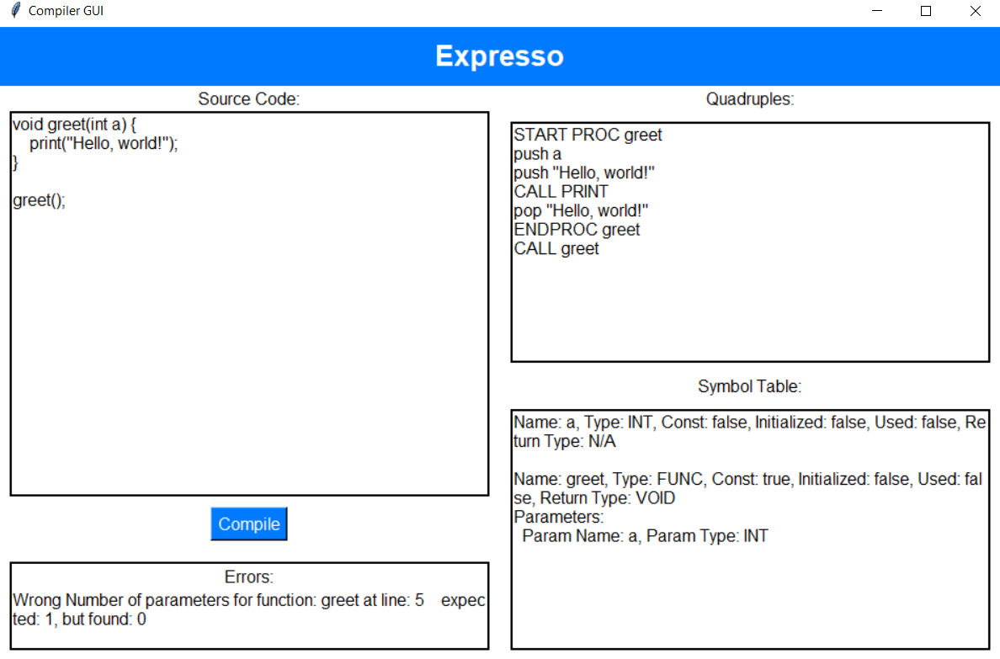
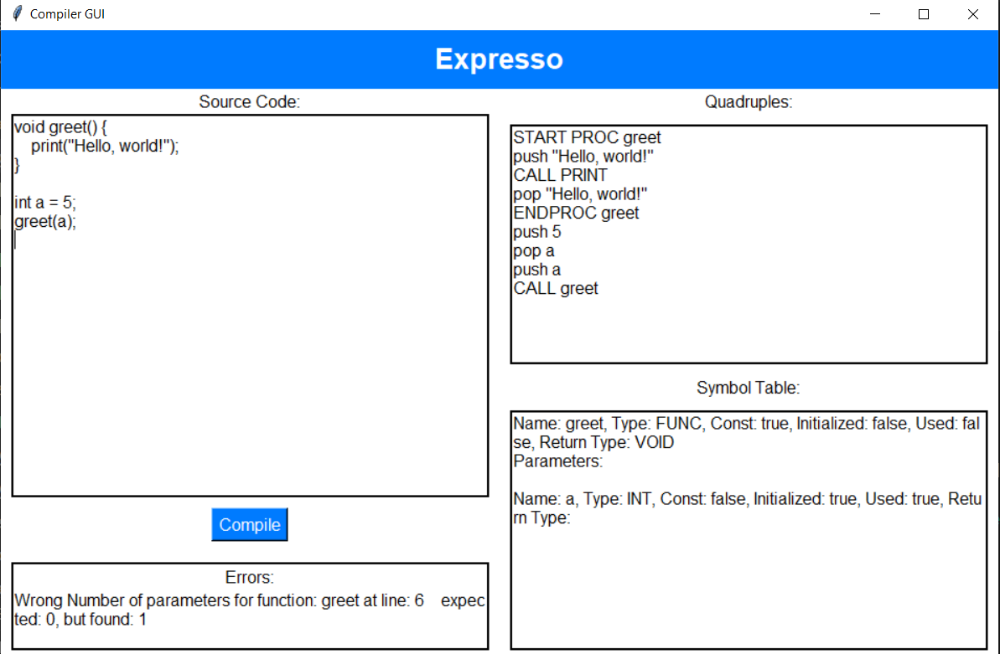

# Expresso  💻☕

<table style="width:100%;"><tr><td align="center">
  
</td></tr></table>

## Introduction

It's a C liked programming language

Sample program:

```c
const int a = 5;
string b = "hello";
if (a == 5) {
    print (a);
}
else {
    if (b == "hello") {
        print (b);
    }
}
```

## Run Steps

- `yacc -d parser.y`: create y.tab.h and y.tab.c
- `lex lex.l`: create lex.yy.c
- `gcc -g lex.yy.c y.tab.c -o main`: create main
- `./main example.txt`: run main

  To run another example change "example.txt" with the example path


## Tools and Technologies

Lex and Yacc are tools commonly used in the field of computer science for constructing compilers and interpreters. They are used to generate lexical analyzers and parsers, which are critical components in the process of translating high-level programming languages into machine-readable code.

<ol>
   <li>
       <b>Lex</b>: is a tool for generating lexical analyzers, also known as lexers or scanners. A lexical analyzer processes an input stream of characters (such as source code) and divides it into a sequence of tokens. Tokens are meaningful sequences of characters, such as keywords, operators, identifiers, and literals.
   </li>
   <li>
       <b>Yacc</b>: Yacc stands for "Yet Another Compiler Compiler." It is a tool used to generate parsers, which analyze the structure of the token sequence produced by the lexer to ensure it conforms to the grammatical rules of the programming language.
   </li>
</ol>


# Workflow

<ol>
 <li>
      <b>Define Tokens with Lex</b> : Create a .l file specifying the tokens and their patterns.
 </li>   
<li>
      <b>Define Grammar with Yacc</b> : Create a .y file specifying the grammar rules and associated actions.
 </li> 
<li>
      <b>Compile and Link</b> : Use Lex to generate a C source file for the lexer, and Yacc to generate a C source file for the parser. Compile and link these with a C compiler.
 </li>
</ol>


## Tokens

<table>
   <tr>
      <th align="left">Token</th>
      <th align="left">Regex</th>
      <th align="left">Description</th>
   </tr>
   <tr>
      <td>FLOAT_VAL</td>
      <td>[0-9]*"."[0-9]+</td>
      <td>Float Numbers.</td>
   </tr>
   <tr>
      <td>INTEGER_VAL</td>
      <td>0 | ([1-9][0-9]*)</td>
      <td>Integer Numbers.</td>
   </tr>
   <tr>
      <td>CHAR_VAL</td>
      <td>'[^\\']'</td>
      <td>One character inside sinqle quotes.</td>
   </tr>
   <tr>
      <td>STRING_VAL</td>
      <td>\"([^\"\\;]|\\.)*\"</td>
      <td>string between double quotes.</td>
   </tr>
   <tr>
      <td>TRUE_VAL</td>
      <td>"true"</td>
      <td>True value.</td>
   </tr>
   <tr>
      <td>FALSE_VAL</td>
      <td>"false"</td>
      <td>False value.</td>
   </tr>
   <tr>
      <td>skip this token</td>
      <td>\/\*([^*]|\*+[^/])*\*+\/</td>
      <td>Multi-line comment.</td>
   </tr>
   <tr>
      <td>skip this token</td>
      <td>\/\/.*</td>
      <td>In-line comment.</td>
   </tr>
   <tr>
      <td>NEW_LINE</td>
      <td>"\n"</td>
      <td>new line.</td>
   </tr>
   <tr>
      <td>IDENTIFIER</td>
      <td>[a-zA-Z_][a-zA-Z0-9_]*</td>
      <td>Identifiers (variables and contants names).</td>
   </tr>
</table>

## Syntax

### Data Types

Tha language supports the following data types:

- Integer
- Float
- Boolean
- String
- Character

It supports modifiers like `const` as well.

```c
const int a = 10;
int b = 20;
float c = 10.5;
bool d = true;
string e = "Hello World";
char f = 'c';
```

### Operators

The language supports the common operators.

```c
// Arithmetic operators
a = b + c;
a = b - c;
a = b * c;
a = b / c;
a = b % c;
a = b++;
a = ++b;
a = b--;
a = --b;
// Logical operators
a = b && c;
a = b || c;
a = !b;
// Relational operators
a = b == c;
a = b != c;
a = b > c;
a = b >= c;
a = b < c;
a = b <= c;
```
### Conditional Statements

The language supports the if-else, and switch-case statements.

```c
int a = 10;
int b = 100;
// if statement
if (a <= 10) {
    print(a);
}
else {
    if (b > 100) {
        print(b);
    }
    else {
        print("else");
    }
}

// switch-case statement
switch (a) {
    case 1: 
        print("1");
        break;
    
    case 2: 
        print("2");
        break;
    
    case 3: 
        print("3");
        break;
    
    default: 
        print("default");
        break;
}

switch (a) {
    case (1): 
        print("1");
        break;
    
    case (2): 
        print("2");
        break;
    
    case (3): 
        print("3");
        break;
}
```

### Loops

The language supports the while, for, and repeat-until loops.

```c
// while loop
int a = 0;
while (a < 20) {
    print(a);
    a = a + 1;
}
print(a);
while (a < 20) {
    if (a == 10) {
        print(a);
    }
    a = a + 1;
}
// for loop
for (int b=2 ; b<10; b++ ) {
    print(b);
    while (b < 10) {
        if (b == 5) {
            print("hi");
            print(b);
        }
    }
}

// repeat-until loop
int a = 0;
repeat {
    print(a);
    a = a + 1;
    print(a);
} until (a == 1);
```

### Functions

The language supports functions with and without parameters. The language also checks for parameters count and types in the function call

```c
void func_1 (){
    print("func_1");
}
void func_2(int a, int b) {
    print("func_2");
    print(a);
    print(b);
}
func_2(1, 2); // function call
```

## Production Rules

<ul>
   <li>program → statements</li>
   <br>
   <li>statements → stmt | statements stmt</li>
   <br>
   <li>stmt → ';'  | datatype IDENTIFIER ';' | datatype IDENTIFIER '=' expr ';' | CONST datatype IDENTIFIER '=' expr ';' | IDENTIFIER '=' expr ';' | PRINT '(' expr ')' ';' | IF '(' expr ')' '{' statements '}' else_stmt | WHILE '(' expr ')' '{' statements '}' |  FOR '(' assignment ';' expr ';' IDENTIFIER '=' expr ')' '{' statements '}' | REPEAT '{' statements '}' UNTIL '(' expr ')' ';' | SWITCH '(' switch_identifier ')' '{' case_list '}' | '{' statements'}' | VOID IDENTIFIER  '(' parameters_list ')' '{' statements '}' | datatype IDENTIFIER'(' parameters_list ')' '{' statements '}'  | function_call | return_stmt</li>
   <br>
   <li>return_stmt → RETURN ';' | RETURN expr ';'</li>
   <br>
   <li>function_call → IDENTIFIER '(' parameters_list_call ')'</li>
    <br>
   <li>else_stmt → /*Empty production*/ | ELSE '{'  statements '}' </li>
    <br>
   <li>datatype → INTEGER | FLOAT | CHAR | STRING | BOOL </li>
    <br>
   <li>assignment → datatype IDENTIFIER '=' expr </li>
    <br>
   <li>var_declaration → datatype IDENTIFIER </li>
    <br>
   <li>parameters_list → /* Empty production */ | var_declaration | parameters_list ',' var_declaration </li>
    <br>
   <li>parameters_list_call → /* Empty production */ | IDENTIFIER | parameters_list_call ',' IDENTIFIER </li>
    <br>
   <li>case_list → case_stmt | case_list case_stmt | case_list default_case</li>
    <br>
   <li>case_stmt → CASE  expr':' statements BREAK ';'</li>
    <br>
   <li>default_case → DEFAULT ':' statements BREAK ';'</li>
    <br>
   <li>switch_identifier → IDENTIFIER</li>
    <br>
   <li>terminals → TRUE_VAL | FALSE_VAL | function_call | IDENTIFIER | INTEGER_VAL | FLOAT_VAL | CHAR_VAL | STRING_VAL</li>
    <br>
   <li>expr → | '(' expr ')'	| '-' expr | INCR expr | expr INCR | DECR expr | expr DECR | expr '+' expr | expr '-' expr | expr '*' expr | expr '/' expr | expr '^' expr | expr '%' expr | expr LOGICAL_AND expr | expr LOGICAL_OR expr | LOGICAL_NOT expr | expr EQUALS expr | expr NOT_EQUALS expr | | expr LESS_THAN_OR_EQUALS expr | expr GREATER_THAN expr | expr GREATER_THAN_OR_EQUALS expr</li>
</ul>


## Quadruples

### Procedures

 **Quadruples** | **Description**                                                   |    **ARG1**     |    **ARG2**     |
----------------|-------------------------------------------------------------------|-----------------|-----------------|
**START PROC**  | Declare of a procedure                                            | procedure name  |                 |
 **ENDPROC**    | End of a procedure                                                | procedure name  |                 |                 
 **CALL**       | Calls a procedure, handles all the stuff related to the PC        | procedure name  |                 |                 

 ### Variables

 **Quadruples** | **Description**                                                   |    **ARG1**               |    **ARG2**     |    **RES**      |
----------------|-------------------------------------------------------------------|---------------------------|-----------------|-----------------|
 **PUSH**       | Push to the stack frame                                           | Identifier/Expr/parameter |                 |                 |
 **POP**        | Pop from the stack frame                                          | Identifier/Expr/parameter |                 |                 |

 ### Branching & Jumps

 **Quadruples** | **Description**                                                             |    **ARG1**     |    **ARG2**     | 
----------------|-----------------------------------------------------------------------------|-----------------|-----------------|
 **JMP**        | Unconditional jump to the label                                             |    label        |                 |                 
 **JZ**         | Jumps to the label if the result of the last relational operation is true   |    label        |                 |                 
 **JNZ**        | Jumps to the label if the result of the last relational operation is falze  |    label        |                 |                 

 ### Arithmetic Operations

 **Quadruples** | **Description**                                                       |    **ARG1**     |    **ARG2**     |
----------------|-----------------------------------------------------------------------|-----------------|-----------------|
 **NEG**        | Get the opposite sign of an expression                                | expression      |                 |                 
 **ADD**        | Add two expressions                                                   | expression      | expression      |                 
 **SUB**        | Subtract two expressions                                              | expression      | expression      |                
 **MUL**        | Multiply two expressions                                              | expression      | expression      |                 
 **DIV**        | Divide two expressions                                                | expression      | expression      |                 
 **MOD**        | Modulus two expressions                                               | expression      | expression      |                 
 **POST_INCR**  | Increment One expression after the operation                          | expression      |                 |                 
 **PRE_INCR**   | Increment One expression before the operation                         | expression      |                 |                 
 **POST_DECR**  | Decrement One expression after the operation                          | expression      |                 |                 
 **PRE_DECR**   | Decrement One expression before the operation                         | expression      |                 |                 

 ### Logical Operations
    
 **Quadruples** | **Description**                                                       |    **ARG1**     |    **ARG2**     |
----------------|-----------------------------------------------------------------------|-----------------|-----------------|
 **LOGICAL_OR** | Get the logical or of two expressions                                 | expression      | expression      |                
 **LOGICAL_AND**| Get the logical or of two expressions                                 | expression      | expression      |                 
 **LOGICAL_NOT**| Get the logical not of 1 expression                                   | expression      |                 |                 
 **EQ**         | Check if two expressions are equal                                    | expression      | expression      |               
 **NEQ**        | Check if two expressions are not equal                                | expression      | expression      |                 
 **GT**         | Check if the first expression is greater than the second              | expression      | expression      |                
 **GTQ**        | Check if the first expression is greater than or equal the second     | expression      | expression      |                
 **LT**         | Check if the first expression is less than the second                 | expression      | expression      |                 
 **LTQ**        | Check if the first expression is less than or equal the second        | expression      | expression      |                

## Semantic Errors

Semantic Errors         
-------------------
 **TYPE_MISMATCH** 
 
 **UNDECLARED**    
 
 **UNINITIALIZED** 
 
 **UNUSED**        
 
 **REDECLARED**    
 
 **CONSTANT**      
 
 **OUT_OF_SCOPE**
 
 **Wrong Number of Parameters In Fumction Call**
 
 **Wrong Parameters Types In Fumction Call**

 ## Examples 

**Variables**
</br>
 
 
 </br>
**Switch case**
  
  </br>
**For loop**
</br>
 
 </br>
 **Functions**
 <br>
 
 

